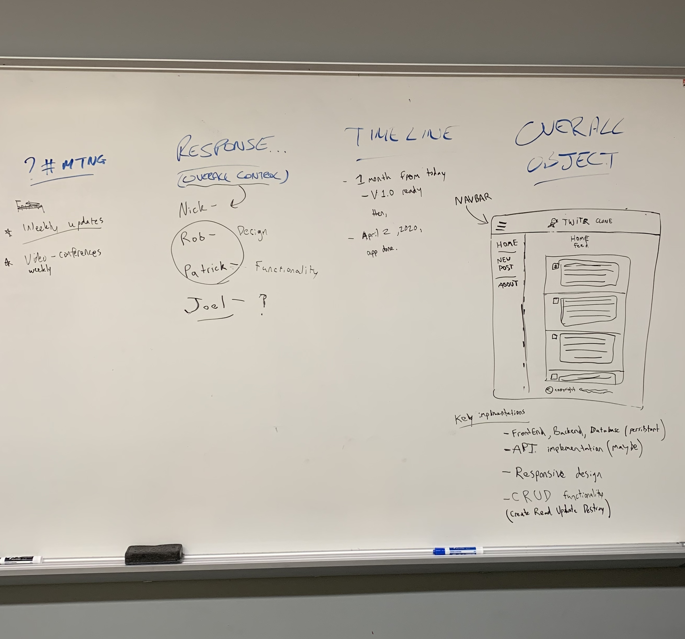

# [Live Link!](https://cscctwitterclone.herokuapp.com/posts)
# [Informational Site](https://nickballdev.com/group-project-info/)

## [ Nick, Robert, Patrick, Joel, Garrett ] - the group
The repository that hosts everything that has to do with the group project we started for the apprenticeship program at CSCC.

### First, we conceptualized the final product, and how we are going to get there, on a whiteboard.

  

### Next, since I (nick ball) am the group lead, I created a functional proof of concept app and we discussed what we liked/did not like about it, as well as what was the main revisions there would need to be for our final product.

  

### From there, we met up many times as a group, and had to overcome obstacles to bring the project to fruition after the coronavirus struck during the spring semester. But sticking with it, we finally brought the project to light and made it functional. I was very lucky to have the opportunity to lead the group. Along with that responsibility, I was lucky to be able to outline our goals and timeline as well as having creative control over the project. I faced and overcame countless hiccups along with way, but using the STAR method, all obstacles were indeed overcome, and the end result is certainly something to be proud of.
